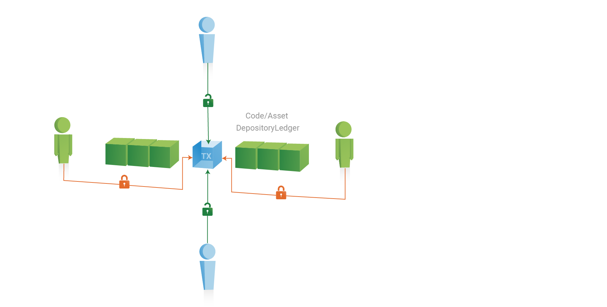
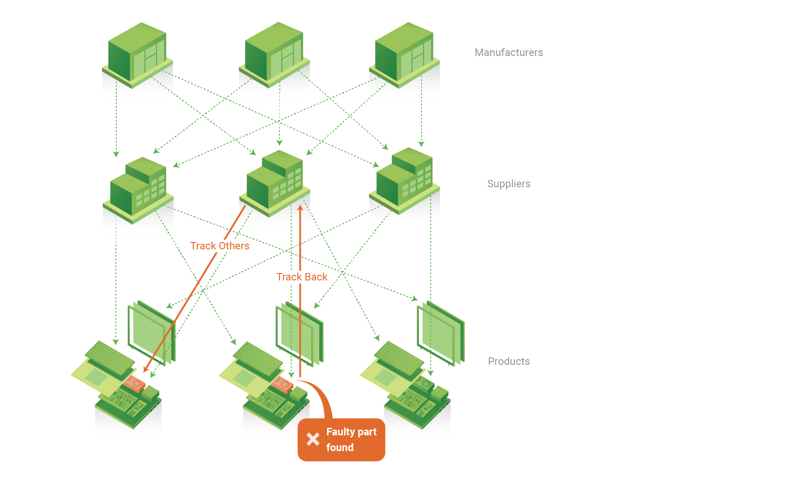
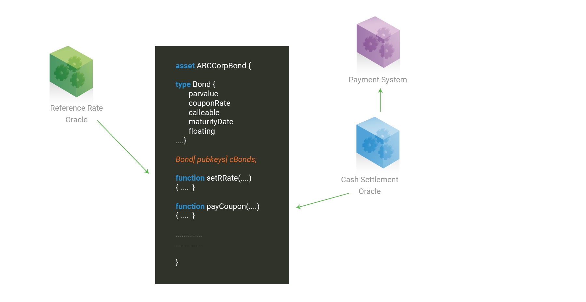
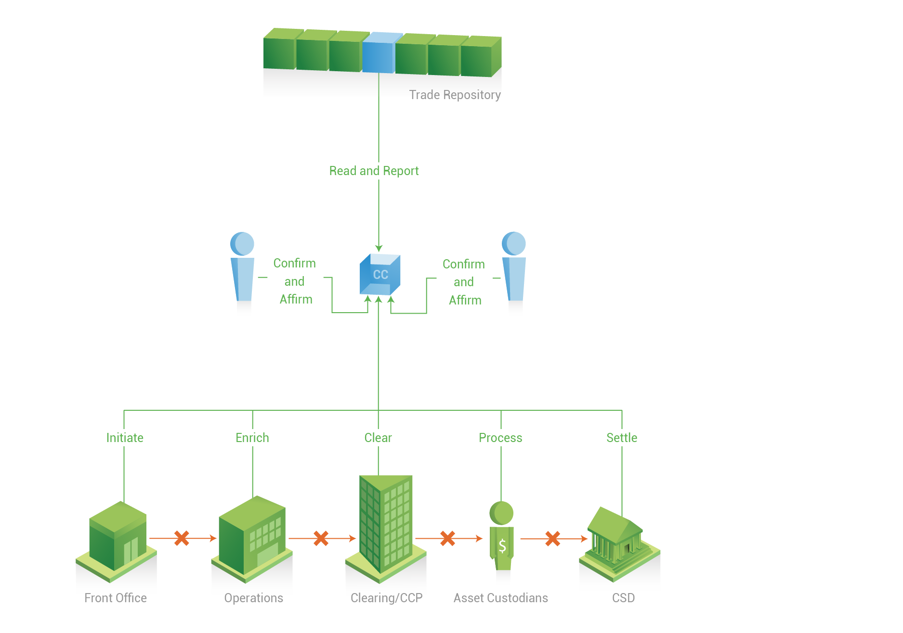
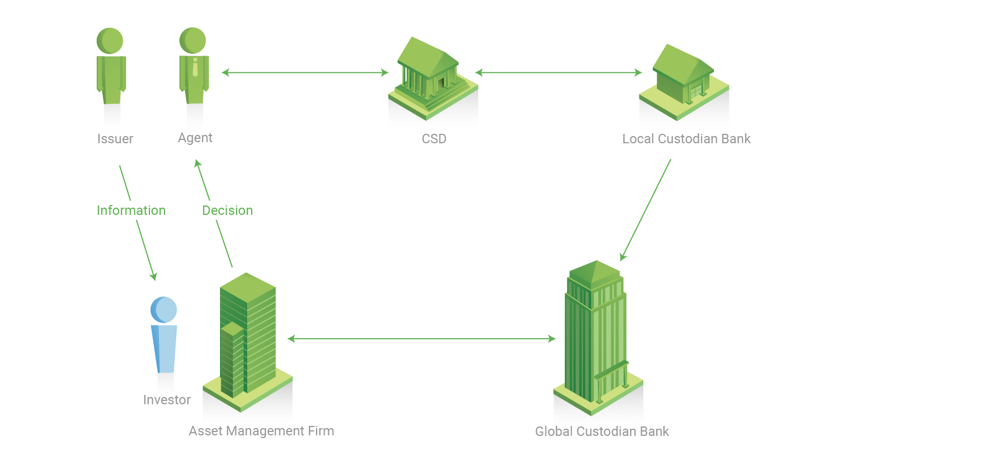
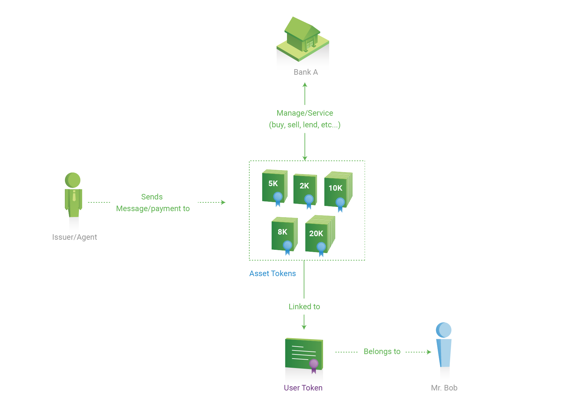
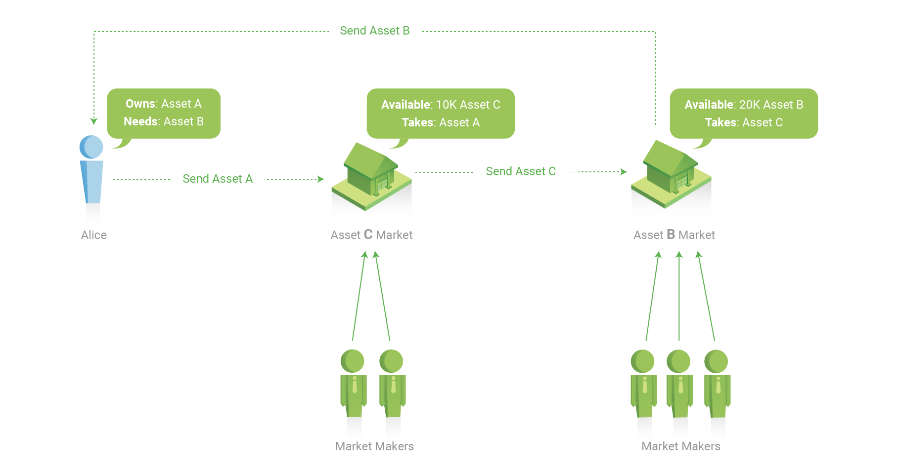

#商业用例规范

&nbsp;

### 企业间合约

商业合约能够使涉及到两方或多方的协议合同以一种可信赖的方式自动执行。 尽管区块链上的信息被默认为“公开的”，商业合约也会提供隐私控制机制来保证企业间的敏感信息不会泄露给合约参与者以外的人员。

尽管保密协议是商业用例中的重要的一项，然而也有许多情况合约的内容需要对账本上的所有参与者可见。比如创建一个用来招标的账本，按照规定这个账本应被设计为无权限访问。这种合约需要被标准化以便竞标者可以轻松访问，并能有效通过智能合约（又名：链码）来创建电子贸易平台。

#### 角色

*  合约参与者 – 合约当事人

*  第三方参与者 – 第三方利益相关者，来保证合约的信誉.

#### 重要性质

*  多方签名激活合约 - 当合约首次由某一方合约当事人部署到账本上时，合约会处于等待激活状态。若要激活合约，需要所有其他合约当事人方以及（或者）第三方参与者的签名。

*  多方签名执行合约 - 某些合约在执行时也需要一方或多方签名。比如在贸易金融中，只有当收货人或第三方（如快递公司）确认发货之后，付款指令才会被执行。

*  可发现性 - 如果合约的内容是关于商业招标，这个合约必须易于查找。另外，这样的合约也必须内置评估，选择和调节竞价的机制。 

*  合约分块执行 - 合约分块执行可以保证仅有在货款到账的情况下才会进行货物转移（运送vs支付）. 如果交易过程中任意一个步骤出现问题，交易必须终止并返回交易前状态。 

*  合约与链码间通信 - 合约必须能够和部署在同一个账本上的链码进行通信。

*  更长时间有效的合约 - 企业间合约由于执行时间较长，则需要引入计时器来记录用时。

*  可复用合约 - 对常用合约进行标准化以便反复使用。

*  可审计的合同协议 - 任何合约都应设定为可以被第三方审计。

*  合约生命周期管理 - 企业间合约都是专有的，不可能把所有的合约都标准化。因此一个有效的合约管理系统就尤为重要，该系统可以用来提升账本网络的规模。

*  验证权限 – 只有拥有验证权限的节点才可以验证企业间合约的交易。

*  查看权限 – 企业间合约也会包含保密信息，只有被授与查看权限的账户才能查看和质询这些信息。

&nbsp;

### 制造商供应链

对于一个处在供应链终端的装配企业来说，比如汽车制造商，它可以创建一个由它的同行们和供应商共同维护的供应链网络。这样汽车制造商就能更好地管理它的供应商也能更好的应对汽车召回这样的事件（这类事件通常因为供应商提供了不合规格的零件而引发）。fabric的区块链必须提供标准的协议来确保供应链网络上的每个参与者都能写入或追踪任意一辆汽车上的任意部件。

为什么我们把这个合约用例单独列出来呢? 因为尽管所有区块链主要用来存储不可更改的信息，然而有些区块链应用具有实现在不同实体间转移财物的需求。本例就特别指出深度逆向搜索交易的需求，有时甚至需要搜索5到10层历史交易。在供应链中如果许多成品都是由其他部件装配而成，而这种逆向追踪搜索的能力就能找出一个成品所有部件的原产地。

#### 角色

*  终端装配企业 – 供应链终端把零部件装配成最终成品的企业。

*  部件供应商 – 供应零部件的供应商。 供应商也会把下级供应商提供的更零散的部件装配成其他部件或成品，然后提供给终端装配企业。

#### 重要部分

*  货到后付款 - 需要继承链外支付系统，区块链可以保证当部件送达后再执行支付指令。

*  第三方审计 -  所有的部件必须对第三方开发审计验收。比如，监管者可能需要追踪某一部件供应商供应的部件的总数，为了税务方面原因。

*  发货过程不可见 - 发货结算数额必须设为不可见否则供应商可以借此推测出同行的商业活动信息。

*  市场规模不可见 - 结算数额总数不许设为不可见否则供应商可以借此推测出自己所占的市场份额，由此可能引发制定合约条款时非公正竞争。

*  验证权限 – 只有拥有验证权限的节点才可以验证交易（部件发货）。

*  查看权限 – 只有被授与查看权限的账户才能质询运送的部件以及可用部件的结算数额。

&nbsp;

### 财产保管

像金融证券这样的财产必须以非实质的形态存在区块链网络上，这样某种特定财产的持有者们就可以通过区块链直接访问这些的财产、发起交易或查询信息，而不再需要聘请律师来作为中间媒介。财产的交易应当近实时完成同时其他财产持有者必须能够近实时访问到该交易信息。 一个财产持有者应该能够根据财产类型添加商业条例，比如可以使用自动执行逻辑来进一步降低操作花销。

#### 角色

*  证券持有者 – 该财产的合法拥有者和受益者。

*  证券发行者 – 发行财产的商业实体，财产以非实质的形式存储在区块链网络上。

*  托管人 – 受证券持有者的雇佣来管理他们的财产,在管理财产同时也会提供其他增值服务。

*  证券保管机构 – 非实质化的财产的存储处。

#### 重要部分

*  财产现金转换 - 很有必要添加链外支付系统以便证券发行者能从证券持有者手中收款。 

*  参考利率 - 某些特殊种类的财产（比如浮动利率票据）可能会具有一些属性需要用到外部数据（如参考利率）, 这些数据也必须添加到账本网络上。

*  财产计时器 - 许多种类的金融财产都有自己的生命周期同时也可能需要周期性向财产持有者付款， 因此要自动执行管理财产的操作，添加计时器是很有必要的。

*  财产审计员 - 财产的交易必须能有被第三方审计。 比如监管部门要通过审计财产交易和转移来评估市场风险。

*  账户余额不可见 - 每个人的账户余额必须是不可见的，这样他人就不能通过余额来推测证券持有者持有财产的数量。

*  验证权限 –  只有拥有验证权限的节点才可以验证涉及到更新财产余额是交易。（这些节点控制权可以限制在中央证券托管机构和（或）债券发行者中）.

*  查看权限 – 只有被授与查看权限的账户才能查看和质询定义财产类型的链码。 如果该财产表示的是公开上市交易公司的股份的话，查看权限应当授予网络中的所有参与实体。

&nbsp;

# 扩展用例

如下列出的扩展用例为检测附加需求和场景。

### 一场交易中使用同一个合约

从一起交易抵达前台部门起知道这起交易最终完成,交易中所有的参与人员都会使用同一个写明了交易细则的合约。 中间部门会丰富前台部门提交的电子合约的内容，同样交易的另一方也在使用同一个合约来确认交易。 最后，证券保管机构通过执行合约中的交易指令来完成交易。 当处理多起交易时，最初的合约可以分解成多个下级合约，每个下级合约都会连接到最初的合约。 

&nbsp;

### Direct Communication

A公司宣布他们公司计划通过股权发行的方式集资20亿美元。由于这属于有目标的有意行为，A公司必须必须保证这个提议的全部细节都能实时送到股东手中，不管这个过程中涉及到多少中间机构（如收款付款代理，中央证券托管机构，国际中央证券托管机构，本地或全球的托管银行，财产管理公司等）。一旦某个股东做出了决定，这个决定将会被实时处理（包括发行新股份）。 如果某个股东把他持有的股权转让给了第三方，证券保管机构必须能够把这些新股权记录在新的持有者名下。

&nbsp;

### 财产所有权的分离和委托人的职责

财产应当永远属于它的真正所有者，而财产所有者必须能够在不转让财产所有权的情况下，让第三方的专业人员（如存管代理人）帮助他们管理财产。如果证券发行者想向财产拥有者发送消息（比如发送股东名单）或者汇款，发行者就需要直接发送给财产所有人。第三方财产管理或托管机构总是能够代表财产所有者进行财产的买卖及租赁。通过这样的安排，财产托管人可以专注于为股份持有者提供资产增值服务，而不用关心股权相关的责任，比如证券持有者和股东之间付款的管理和重定向问题等。

&nbsp;

### 财产间的相互操作性

如果某个机构需要20000个单位的B财产，同时它却拥有者10000个单位的A财产，那它就需要想出个办法吧A财产转换成B财产。尽管当前的市场并不能提供足够的资产流动性来满足这笔交易，但A财产和C财产，C财产和B财产之间却有着足够的可用流动性。与其想办法解决A财产和B财产之间的市场紧缺问题，区块链网络可以帮买家联系潜在的卖家（可能几次财产转化之后），匹配到最合适的卖家并执行交易。

